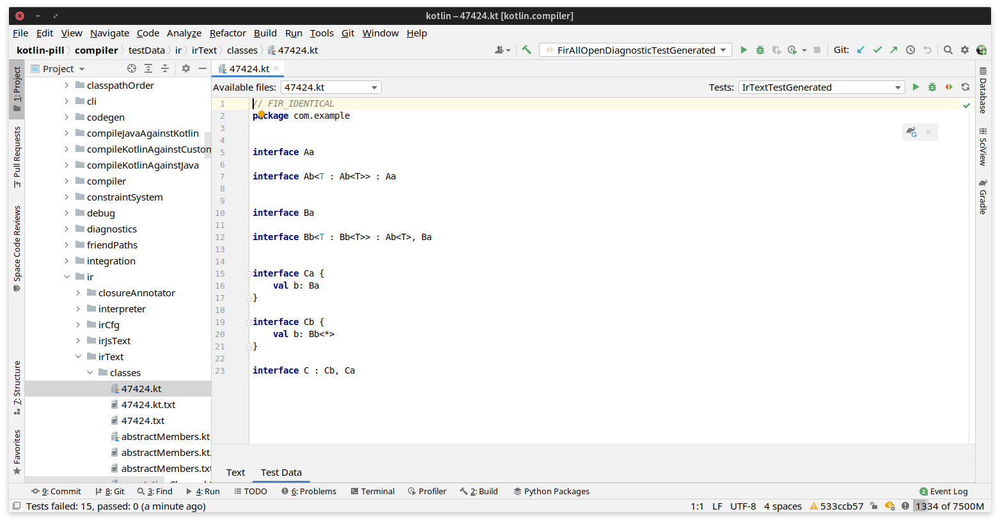
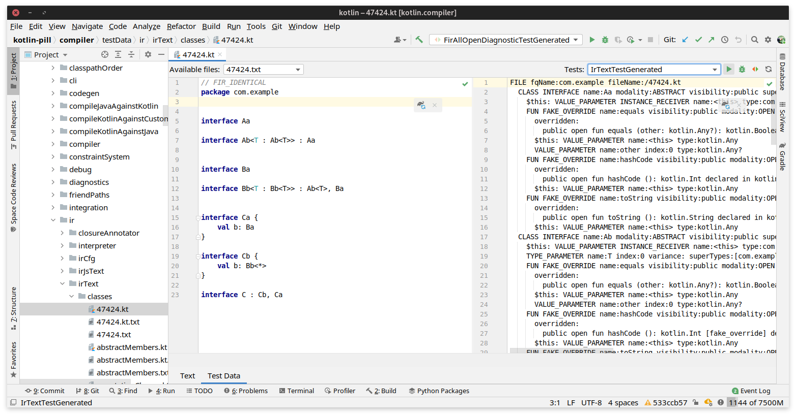
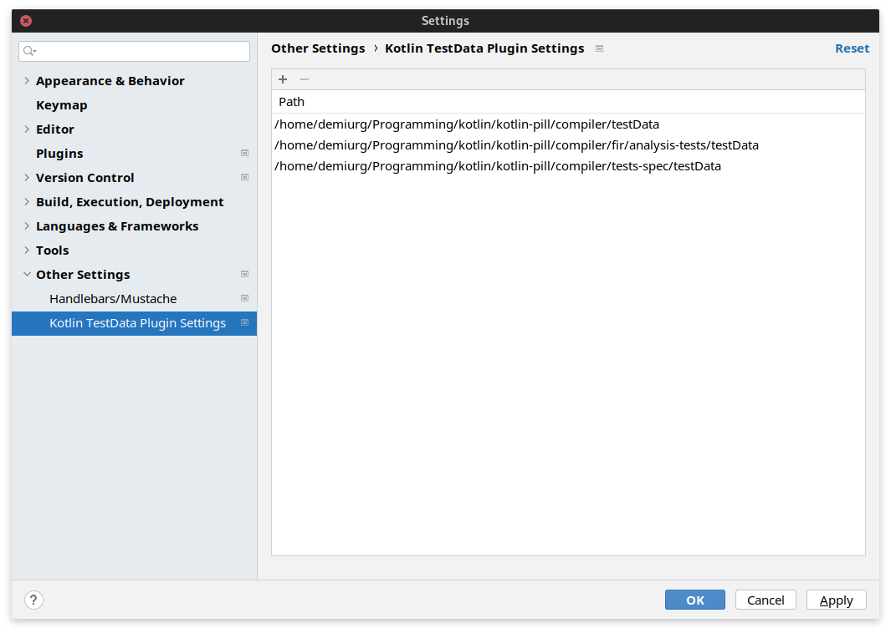

# Kotlin Compiler DevKit

[](https://plugins.jetbrains.com/plugin/27616)
[](https://plugins.jetbrains.com/plugin/27616)

<!-- Plugin description -->

This plugin enhances the development experience when working with compiler tests in
the [Kotlin](https://github.com/JetBrains/kotlin) project.

### Key Features:

- Split-view editor for test data files and their related files
- Quick test execution for specific generated tests associated with the opened test data file
- Batch execution of all tests associated with the current file
- Support for running tests from any module using inclusion filters (`--tests`)
- Copy Kotlin testdata text without metadata (`Copy Without Metadata` action)

#### Preview

Test Data Editor:


Split View for Related Test Files:


#### Setup

The plugin enhances the editor for `.kt` files located in directories specified in the plugin settings. These settings
are stored per project in `.idea/kotlinTestDataPluginTestDataPaths.xml`.



The plugin identifies related test files using the following convention: for a test file named `someName.kt`, all files
that begin with `someName.` are considered related and will appear in the left combo box of the split mode view.
You can configure the plugin to search for related files in additional locations beyond the test file's directory.
This feature is particularly useful when working with Kotlin/JS tests, where you might want to view generated code
alongside the test file.

The plugin identifies test methods for the opened file using these rules:

1. For a test file named `someName.kt`, the corresponding test method should be named `testSomeName` and marked with a
   test annotation (e.g., `@Test` from JUnit)
2. The test method must be annotated with `@org.jetbrains.kotlin.test.TestMetadata`, with the filename as its argument:
   `@TestMetadata("someName.kt")`
3. The class containing the test method must also be annotated with `@TestMetadata`, where the argument specifies the
   path to the directory containing `someName.kt`

The plugin scans your project for methods meeting these conditions and adds run configuration buttons to the editor
toolbar. The toolbar also includes:

- A _Reload_ button to refresh the test method detection (useful when adding new test methods)
- A _Run All_ button to execute all detected test methods via Gradle

<!-- Plugin description end -->

#### Running Tests from Arbitrary Modules

The plugin adds a Run Anything provider that introduces a command `testGlobally`.
It accepts a sequence of test filters, finds the relevant modules and then calls their `:test` Gradle tasks with the
relevant filters.

The syntax is: `testGlobally [--tests <pattern>]*`.
For example: `testGlobally --tests 'a.b.Test$Sub.testSomething' --tests a.b.*`.

There's a limitation, though: the packages must be fully specified, and only their initial part that doesn't contain
wildcards will be considered for searching for the relevant modules.
Also note that specifying a filter without a package (`--tests SomeTestGenerated`) will result in all modules with test
source sets being called via `:test`.
The algorithm searches for the relevant module by comparing the package with the directory structure, and the empty package 
represents the source set root which is always present for every source set.

### Build plugin from sources

The following command will build the plugin distribution to a file like `./build/distributions/kotlin-compiler-devkit-1.0.999-SNAPSHOT.zip`:

```shell
./gradlew buildPlugin
```
