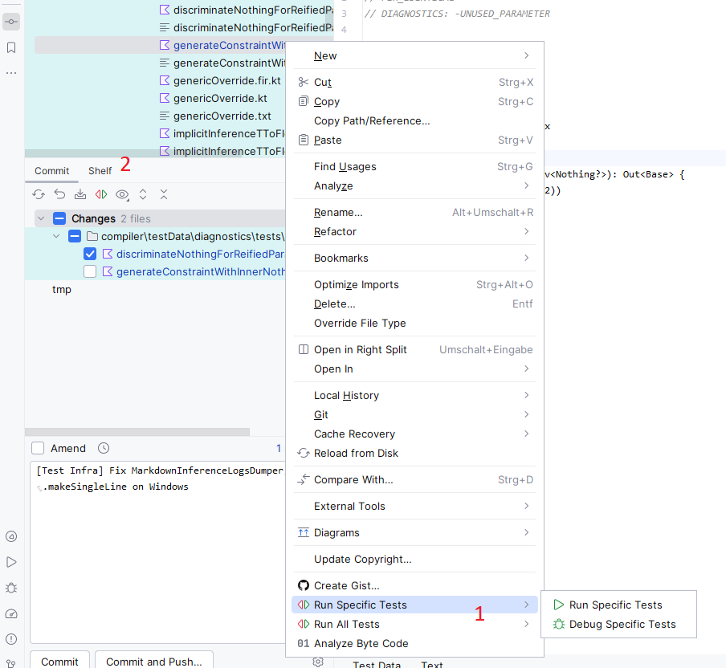
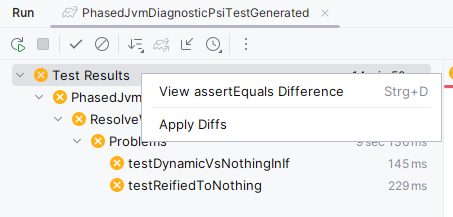
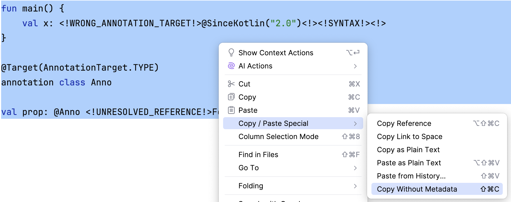

# Kotlin Compiler DevKit


[](https://plugins.jetbrains.com/plugin/27616)
[](https://plugins.jetbrains.com/plugin/27616)

<!-- Plugin description -->

This plugin enhances the development experience when working with compiler tests in
the [Kotlin](https://github.com/JetBrains/kotlin) project or Kotlin compiler plugins.

## Setup

The plugin enhances the editor for `.kt` files located in directories specified in the plugin settings. These settings
are stored per project in `.idea/kotlinTestDataPluginTestDataPaths.xml`.


The plugin identifies related test files using the following convention: for a test file named `someName.kt`, all files
that begin with `someName.` are considered related and will appear in the left combo box of the split mode view.
You can configure the plugin to search for related files in additional locations beyond the test file's directory.
This feature is particularly useful when working with Kotlin/JS tests, where you might want to view generated code
alongside the test file.

The plugin identifies test methods for the opened file using these rules:

1. For a test file named `someName.kt`, the corresponding test method should be named `testSomeName` and marked with a
   test annotation (e.g., `@Test` from JUnit)
2. The test method must be annotated with `@org.jetbrains.kotlin.test.TestMetadata`, with the filename as its argument:
   `@TestMetadata("someName.kt")`
3. The class containing the test method must also be annotated with `@TestMetadata`, where the argument specifies the
   path to the directory containing `someName.kt`

The plugin scans your project for methods meeting these conditions and adds run configuration buttons to the editor
toolbar.

## Features
### Test Data Editor


When opening a test data file, the special editor can be opened using the tabs in the bottom left (1).

It allows opening a related file in a split view in addition to the main file (2).
The button with the arrows will open a diff between the two files.

In the top right, a toolbar (3) can be found that offers the following features:

- Selecting a test runner
- Running or debugging the test using the selected runner
- Going to a runner source
- Running the test with all runners
- Reloading test runners
- Regenerating test runners (will run the `generateTests` Gradle task or an optimized set of tasks for diagnostic tests)
- Running one or all test runners and applying diffs (see Apply Diffs), optionally after regenerating tests

### Run Tests from Various Menus



Using the context menu of **one or multiple files or directories** containing test data files
(e.g. in the Project tool window, in breadcrumbs, in VCS), you can run or debug the test(s) using one or all test runners (1).

In the commit tool window, an action (2) is available to run all tests on all modified test data files. 

### Apply Diffs



When tests fail with assertion errors related to files, the diffs can be applied using the context menu in the test
tool window. It works on individual tests, groups of tests or all tests.

### Running Tests from Arbitrary Modules

The plugin adds a Run Anything provider that introduces a command `testGlobally`.
It accepts a sequence of test filters, finds the relevant modules and then calls their `:test` Gradle tasks with the
relevant filters.

The syntax is: `testGlobally [--tests <pattern>]*`.
For example: `testGlobally --tests 'a.b.Test$Sub.testSomething' --tests a.b.*`.

There's a limitation, though: the packages must be fully specified, and only their initial part that doesn't contain
wildcards will be considered for searching for the relevant modules.
Also note that specifying a filter without a package (`--tests SomeTestGenerated`) will result in all modules with test
source sets being called via `:test`.
The algorithm searches for the relevant module by comparing the package with the directory structure, and the empty package 
represents the source set root which is always present for every source set.

### Copying Test Data without Metadata



This action will copy the selected testdata text in the editor with stripped metadata: 
diagnostics and tags like `<caret>`, `<expr>`, `<selection>`. You can also assign a custom shortcut to this action.

<!-- Plugin description end -->

## Build plugin from sources

The following command will build the plugin distribution to a file like `./build/distributions/kotlin-compiler-devkit-1.0.999-SNAPSHOT.zip`:

```shell
./gradlew buildPlugin
```
